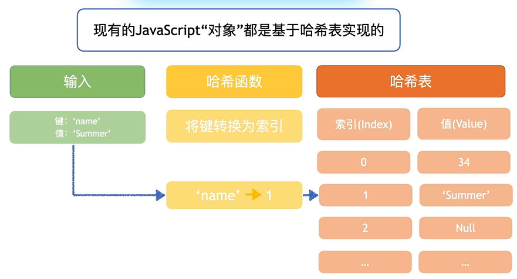

## 什么是哈希表 ( Hash Table )



1. 为什么使用表格
```javascript
const words = 'helloworld'

// 双重 for 循环
function findFirst(str) {
  for(let i = 0; i < str.length; i++) {
    for(let j = i + 1; j < str.length; j++) {
      if(str[i] === str[j]){
        return str[i]
      }
    }
  }
}

// 大 O 符号 O(n^2)
console.log(findFirst(words))

// 通过对象 ( 哈希表 ) 
function findFirstRep(str) {
  const table = {}
  for(const word of str) {
    if(table[word]) {
      return word
    }
    table[word] = 1
  }
}

// 大 O 符号 O(n)
console.log(findFirstRep(words))
```
