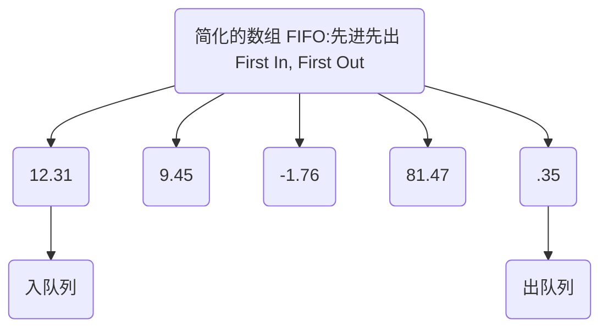

## 列表 - 队列 (Queue)

1. 先进先出，谁先进来谁先出去

## 自定义队列 ( 数组实现 )

```javascript
class Queue {
  constructor() {
    this.items = []
  }

  enqueue(value) {
    this.items.unshift(value)
  }

  dequeue() {
    return this.items.pop()   
  }

  isEmpty() {
    return this.items.length === 0
  }

  toArray() {
    return this.items.slice()
  }
}
```

## 自定义队列 ( 链表实现 )

```javascript
class Queue {
  constructor() {
    this.list = new LinkedList();
  }
  enqueue(value) {
    this.list.append(value)
  }
  
  dequeue() {
    return this.list.deleteHead()
  }

  isEmpty() {
    return !this.list.head
  }

  toArray() {
    return this.list.toArray()
  }
}
```


## 队列时间复杂度&数组
|  | 队列(Queue) | 数组(Array) |
| ---- | ---- | ---- |
| 元素访问 | O(1)仅限"第一个元素" | O(1) |
| 末尾插入 | O(n)会导致"数据丢失" | O(1) |
| 头部插入 | O(1) | O(n) |
| 中间插入 | O(n)会导致"数据丢失" | O(n) |
| 元素搜索 | O(n)会导致"数据丢失" | O(n) |

