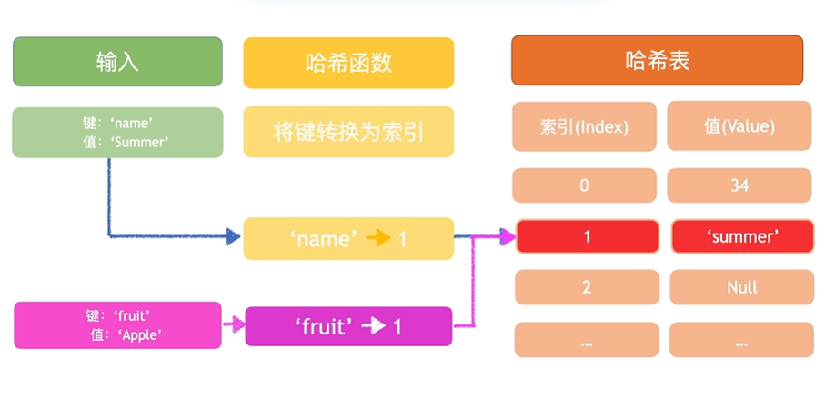
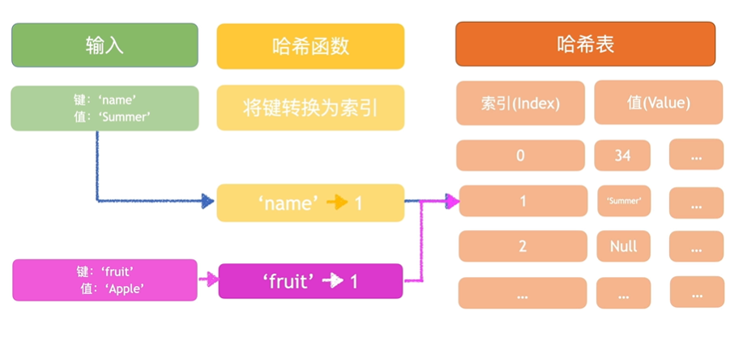
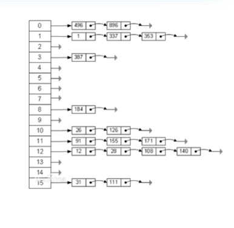

## 表格 - 哈希表 ( Hash Table )

```javascript
class HashTable {
  constructor() {
    this.size = 16
    this.buckets = Array(16).fill(null)
  }

  hash(key) {
    let hash = 0;
    for (const char of key) {
      hash += char.charCodeAt(0)
    }
    // console.log(`${hash % this.size} --> ${key}`)
    return hash % this.size
  }

  set(key, value) {
    const keyHash = this.hash(key)
    this.buckets[keyHash] = value
    // console.log(this.buckets)
  }

  get(key) {
    const keyHash = this.hash(key)
    return this.buckets[keyHash]
  }

  showInfo() {
    // console.log(this.buckets)
    for(let i = 0; i < this.buckets.length; i++) {
      // console.log(i, this.buckets[i])
      if(this.buckets[i] !== null && this.buckets[i] !== undefined) {
        console.log(i, this.buckets[i])
      }
    }
  }
}
```

## 哈希碰撞


  - 跟内存有多大设置的哈希函数有多么的优化都是没有太大关系的
  - 不管你内存给的有多少，他的内存都是有限的，不可能无限的给哈希表分配内存
  - 对于哈希函数来说，也没法做到在内存有限的情况下，输出的哈希值都是确保是不同的
  - 没法避免遇到哈希碰撞
  - 空间越大，效率越低 

1. 如何解决 Hash 碰撞 （链地址法）


  
  把值做成链表格式

  ##### 官方解释

  
  
  - 每个哈希表都有一个 `next` 的指针 而多个 `hash` 表的节点，可以用 ` next ` 指针构成一个单项的列表

```javascript
class HashTable {
  constructor() {
    this.size = 16
    this.buckets = Array(16).fill(null).map(() => [])
  }

  hash(key) {
    let hash = 0;
    for (const char of key) {
      hash += char.charCodeAt(0)
    }
    return hash % this.size
  }

  set(key, value) {
    const keyHash = this.hash(key)
    const bucketArray = this.buckets[keyHash]
    const storedElement = bucketArray.find((ele) => {
      return ele.key === key
    })
    if (storedElement) {
      storedElement.val = value
    } else {
      bucketArray.push({ key: key, val: value })
    }
  }

  get(key) {
    const keyHash = this.hash(key)
    const bucketArray = this.buckets[keyHash]
    const storedElement = bucketArray.find((ele) => {
      return ele.key === key
    })
    return storedElement
  }

  showInfo() {
    for (let i = 0; i < this.buckets.length; i++) {
      if (this.buckets[i] !== null && this.buckets[i] !== undefined) {
        console.log(i, this.buckets[i])
      }
    }
  }
}
```

